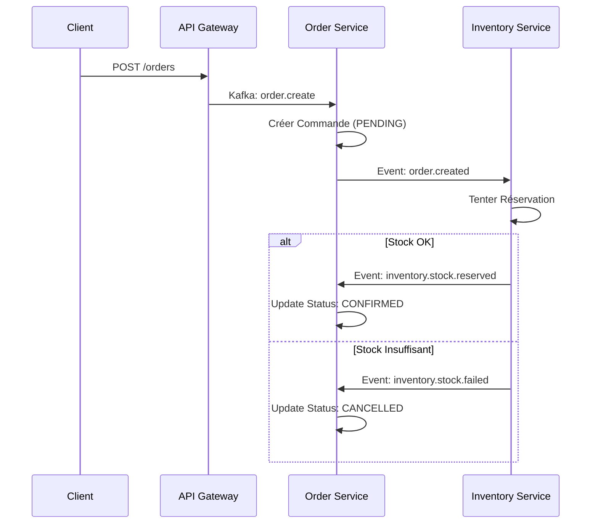

# ShopZone - E-Commerce Microservices


## 1. 📖 Description Générale
**ShopZone** est une plateforme e-commerce moderne construite sur une architecture **microservices** robuste et scalable. Elle utilise **NestJS** comme framework backend principal, **Apache Kafka** pour la communication asynchrone entre les services, et **Prisma** comme ORM avec **PostgreSQL**.

### Technologies Clés
*   **Framework** : NestJS (Monorepo avec Nx)
*   **Messaging** : Apache Kafka (Event-Driven Architecture)
*   **Base de Données** : PostgreSQL
*   **ORM** : Prisma
*   **Sécurité** : JWT (JSON Web Tokens), RBAC (Role-Based Access Control)
*   **Validation** : Class-Validator (DTOs partagés)

---

## 2. 🏗 Architecture & Services

L'application est découpée en 5 services distincts, chacun ayant une responsabilité unique :

| Service | Rôle Principal | Base de Données | Port (HTTP) |
| :--- | :--- | :--- | :--- |
| **API Gateway** | Point d'entrée unique, Routing, Auth Guard, Validation | - | 3000 |
| **Auth Service** | Gestion utilisateurs, Login/Register, Tokens | `db_auth` | 3001 |
| **Catalog Service** | Produits, Catégories, Prix, SKU | `db_catalog` | 3002 |
| **Inventory Service** | Stocks, Réservations, Mouvements | `db_inventory` | 3003 |
| **Order Service** | Commandes, Items, Orchestration Saga | `db_order` | 3004 |

---

## 3. 🔄 Flux & Diagrammes

### Création de Commande (Saga Pattern)
Un processus distribué coordonne la création d'une commande et la réservation de stock :



### Autres Flux Clés
*   **Authentification** : `Gateway` -> `Auth Service` (Request/Reply) -> JWT Token.
*   **Création Produit** : `Catalog Service` (Produit créé) -> `Inventory Service` (Init Stock 0).
*   **Suppression Produit** : `Catalog Service` vérifie `Inventory Service` (Stock == 0 ?) avant suppression.

---

## 4. 📦 Entités & Modèles (Prisma)

### Auth Service
*   `User` : ID, Email, Password (Hashed), Role (USER/ADMIN).
*   `RefreshToken` : Token de rotation sécurisé.

### Catalog Service
*   `Product` : ID, Name, SKU (Unique), Price, Status (PUBLISHED/DRAFT).
*   `Category` : Classification des produits.

### Inventory Service
*   `Inventory` : ProductId, Quantity (Total), Reserved (Bloqué), Location.
*   `StockMovement` : Trace (IN, OUT, RESERVE, ADJUSTMENT).

### Order Service
*   `Order` : ID, UserId, Status (PENDING, CONFIRMED...), TotalAmount.
*   `OrderItem` : Snapshot du produit au moment de l'achat (Prix, Quantité).

---

## 5. 📨 Événements Kafka

Le système repose sur une **Event-Driven Architecture**.

| Sujet / Pattern | Source | Description |
| :--- | :--- | :--- |
| `user.registered` | Gateway | Demande d'inscription. |
| `user.login` | Gateway | Demande de connexion. |
| `product.created` | Catalog | Notification de nouveau produit -> Init Stock. |
| `order.created` | Order | Nouvelle commande -> Demande réservation stock. |
| `inventory.stock.reserved` | Inventory | Stock bloqué avec succès. |
| `inventory.stock.failed` | Inventory | Échec réservation (Stock insuffisant). |
| `order.confirmed` | Order | Commande validée par le stock. |

---

## 6. ✅ Bonnes Pratiques

*   **Validation Stricte** : Utilisation de `ValidationPipe` global et de DTOs partagés (`libs/shared`) pour garantir la qualité des données à l'entrée de la Gateway.
*   **Sécurité** :
    *   **Guards** : `JwtAuthGuard` sur tous les endpoints privés.
    *   **RBAC** : `@Roles(UserRole.ADMIN)` pour les opérations sensibles (ex: modif stock).
*   **Tolérance aux Pannes** : 
    *   Si `Inventory` est down, `Catalog` ne permet pas la suppression de produit (Soft Fail).
    *   Transactions atomiques Prisma pour les mouvements de stock.

---

## 7. 📂 Structure du Projet

```
project/
├── apps/
│   ├── api-gateway/       # Orchestrateur
│   ├── auth-service/      # Identité
│   ├── catalog-service/   # Produits
│   ├── inventory-service/ # Stocks
│   └── order-service/     # Commandes
├── libs/
│   └── shared/            # Code partagé
│       ├── dto/           # Data Transfer Objects (RegisterDto, CreateOrderDto...)
│       ├── enum/          # Enums (UserRole, OrderStatus...)
│       └── prisma/        # Module Prisma partagé (si applicable)
├── docker-compose.yml     # Infrastructure (Postgres, Kafka, Zookeeper)
└── package.json           # Dépendances (Monorepo)
```

---

## 8. 🚀 Installation & Démarrage

### 1. Pré-requis
*   Node.js (v18+)
*   Docker & Docker Compose
*   Pnpm (recommandé) ou Npm

### 2. Installation
```bash
# Cloner le repo
git clone ...
cd shopzone

# Installer les dépendances
pnpm install
```

### 3. Infrastructure
Démarrer les bases de données et Kafka :
```bash
docker-compose up -d
```

### 4. Base de Données (Prisma)
Appliquer les migrations pour chaque service :
```bash
# Auth
npx prisma migrate dev --schema apps/auth-service/prisma/schema.prisma
# Catalog
npx prisma migrate dev --schema apps/catalog-service/prisma/schema.prisma
# Inventory
npx prisma migrate dev --schema apps/inventory-service/prisma/schema.prisma
# Order
npx prisma migrate dev --schema apps/order-service/prisma/schema.prisma
```

### 5. Démarrage des Services
Dans des terminaux séparés :
```bash
nx serve api-gateway
nx serve auth-service
nx serve catalog-service
nx serve inventory-service
nx serve order-service
```

---

## 9. 👩‍💻 Guide pour les Développeurs

### Ajouter un nouveau Microservice
1.  Générer l'app : `nx generate @nestjs/schematics:application my-service`.
2.  Configurer `main.ts` pour utiliser `MicroserviceOptions` avec Kafka.
3.  Ajouter un `Dockerfile` et une entrée dans `docker-compose.yml` (optionnel).
4.  Créer une base de données dédiée dans Postgres.

### Ajouter une nouvelle Entité
1.  Modifier `schema.prisma` dans le service concerné.
2.  Exécuter `npx prisma migrate dev`.
3.  Créer les DTOs correspondants dans `libs/shared/src/dto`.

### Contribuer
*   Toujours utiliser les **DTOs partagés** pour les communications inter-services.
*   Documenter les nouveaux événements Kafka dans ce README.
