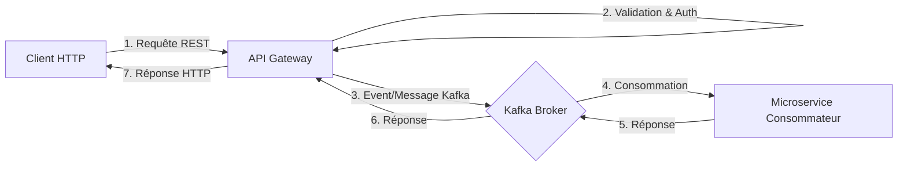

# API Gateway

## 📖 Vue d'ensemble
L'**API Gateway** est le point d'entrée unique pour toutes les requêtes clients (Web, Mobile) de l'application **ShopZone**. Il agit comme un proxy inversé intelligent et un orchestrateur qui redirige les requêtes HTTP vers les microservices appropriés via **Kafka**.

Il centralise les préoccupations transversales telles que l'authentification, la validation des données, et la transformation des erreurs.

---

## 🏗 Architecture & Rôle
Dans notre architecture, l'API Gateway :
*   **Expose une API REST** standardisée aux clients.
*   **Abstracte la complexité** interne des microservices.
*   **Sécurise l'application** en validant les jetons JWT avant de relayer les requêtes sensibles.
*   **Communique via Kafka** (Pattern Request-Response) avec les services backend (`auth`, `catalog`, `inventory`, `order`).

### Flux des Requêtes


---

## 🔗 Services Connectés

| Service | Rôle | Communication |
| :--- | :--- | :--- |
| **Auth Service** | Inscription, Connexion, Gestion des Tokens | `user.*` |
| **Catalog Service** | Gestion des Produits et Catégories | `catalog.*` |
| **Inventory Service** | Gestion des Stocks et Mouvements | `inventory.*` |
| **Order Service** | Gestion des Commandes et Statuts | `order.*` |

---

## 🛠 Responsabilités & Sécurité

### 1. Routing & Communication
Chaque contrôleur (`AuthController`, `ProductController`, etc.) mappe une route HTTP (ex: `POST /auth/login`) vers un pattern de message Kafka (ex: `user.login`).

### 2. Validation
Utilisation de **DTOs partagés** (`libs/shared`) avec `class-validator` et `ValidationPipe` pour rejeter les requêtes malformées avant même qu'elles n'atteignent les microservices.

### 3. Sécurité (Authentication & Authorization)
*   **JWT Auth Guard** : Intercepte les requêtes, vérifie le token `Bearer`, et injecte l'utilisateur dans `request.user`.
*   **Roles Guard (RBAC)** : Vérifie si l'utilisateur possède le rôle requis (`ADMIN`, `USER`) via le décorateur `@Roles()`.

---

## 📂 Structure du Projet
```
apps/api-gateway/src/
├── auth/               # Contrôleur Auth, Guards (Jwt, Roles), Stratégies
├── catalog/            # Contrôleur pour produits et catégories
├── inventory/          # Contrôleur pour la gestion des stocks
├── order/              # Contrôleur pour la gestion des commandes
├── common/             # Stratégies Passport partagées
├── kafka/              # Configuration du client Kafka
├── main.ts             # Configuration globale (Pipes, Cors, Port)
└── app.module.ts       # Importation des modules
```

---

## 📡 Endpoints Principaux

### Authentification (`/auth`)
*   `POST /auth/register` : Créer un compte.
*   `POST /auth/login` : Se connecter (Retourne Access + Refresh Token).
*   `POST /auth/refresh` : Rafraîchir un token.
*   `POST /auth/logout` : Se déconnecter.

### Catalogue (`/products`)
*   `POST /products` : Créer un produit (Admin).
*   `GET /products` : Lister les produits.
*   `GET /products/:id` : Détails d'un produit.

### Inventaire (`/inventory/stock`)
*   `GET /:productId` : Obtenir le stock.
*   `PATCH /:productId` : Mettre à jour le stock (Admin, Full Update).
*   `PATCH /:productId/adjust` : Ajustement relatif (+/-).

### Commandes (`/orders`)
*   `POST /orders` : Créer une commande.
*   `GET /orders` : Lister ses commandes.
*   `POST /orders/:id/cancel` : Annuler une commande.

---

## 🚀 Configuration & Démarrage

### Pré-requis
*   Fichier `.env` configuré à la racine ou dans `apps/api-gateway/.env`.

### Variables d'environnement
```env
PORT=3000
KAFKA_BROKERS=localhost:9092
JWT_SECRET=superSecretKey
```

### Lancer le service
```bash
# Mode développement
nx serve api-gateway

# En production
nx build api-gateway
node dist/apps/api-gateway/main.js
```
